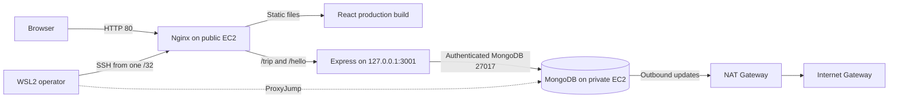

# TravelMemory on AWS with Terraform and Ansible

This repository deploys the TravelMemory MERN application to AWS as a two-tier assignment environment. Terraform creates the network and compute infrastructure; Ansible secures both Ubuntu hosts, configures an authenticated private MongoDB server, builds the React frontend, and runs the Express backend behind Nginx and PM2.

> **Cost warning:** the required NAT Gateway, Elastic IP/public IPv4 address, and EC2 instances can incur charges. Capture evidence in one session and run `terraform destroy` immediately afterward.

## Assignment coverage

- AWS VPC with one public subnet and one private subnet
- Internet Gateway, NAT Gateway, and separate route tables
- Public EC2 web server and private EC2 database server
- Operator-only SSH to the web server and bastion access to the database
- IAM instance profile with Systems Manager core permissions
- Node.js 20, Nginx, PM2, and a production React build
- MongoDB 7 with authorization and separate administrator/application users
- Host firewall and SSH hardening
- Terraform outputs, Ansible Vault, validation instructions, and evidence checklist

## Architecture



The browser never connects directly to Express or MongoDB. Nginx is the only public application entry point. Express connects to MongoDB using its private address and an application-scoped database user.

## Repository layout

```text
backend/                      Express API from TravelMemory
frontend/                     React client from TravelMemory
terraform/                    AWS network, IAM, security, and EC2
ansible/                      Common, MongoDB, and web roles
scripts/                      WSL and PowerShell inventory generators
docs/EXECUTION_GUIDE.md       Full runbook and implementation report
docs/SCREENSHOT_CHECKLIST.md  Submission evidence list
tests/                        Repository contract tests
```

## Prerequisites

- Windows 10/11 with WSL2 Ubuntu, or another Linux control machine
- AWS account allowed to create VPC, EC2, NAT, Elastic IP, security-group, key-pair, and IAM resources
- AWS CLI, Terraform 1.6+, Ansible Core, Git, SSH, Node.js 20+
- A local Ed25519 SSH key

## Quick start

Follow [the complete execution guide](docs/EXECUTION_GUIDE.md). The abbreviated sequence is:

```bash
cp terraform/terraform.tfvars.example terraform/terraform.tfvars
terraform -chdir=terraform init
terraform -chdir=terraform validate
terraform -chdir=terraform plan -out=travelmemory.tfplan
terraform -chdir=terraform apply travelmemory.tfplan

./scripts/generate-inventory.sh
ansible-galaxy collection install -r ansible/requirements.yml
cp ansible/vault.example.yml ansible/group_vars/all/vault.yml
ansible-vault encrypt ansible/group_vars/all/vault.yml
ansible-playbook -i ansible/inventory/hosts.yml ansible/site.yml --ask-vault-pass
```

Open the `application_url` Terraform output, verify create/read persistence, and capture the evidence in [the screenshot checklist](docs/SCREENSHOT_CHECKLIST.md).

## Security summary

- The database EC2 instance has no public IPv4 address.
- Web SSH is restricted to `operator_cidr`, which must be a single `/32` and cannot be `0.0.0.0/0`.
- Database SSH is accepted only from the bastion's public-subnet CIDR.
- MongoDB accepts port 27017 only from the web security group.
- Express listens on localhost and is exposed only through Nginx.
- EC2 root volumes are encrypted and require IMDSv2.
- SSH root/password login is disabled and UFW is enabled.
- Database secrets are encrypted with Ansible Vault and suppressed from Ansible logs.
- Terraform state, local variables, inventory, private keys, and secret files are ignored by Git.

This is an assignment environment served over HTTP by public IP. A domain and TLS termination are intentionally outside scope.

## Verification

```bash
node --test tests/repository-contract.test.js
terraform -chdir=terraform fmt -check -diff
terraform -chdir=terraform validate
ansible-playbook -i ansible/inventory/hosts.yml ansible/site.yml --syntax-check --ask-vault-pass
```

Run the playbook twice. On the second run, investigate any unexpected changed tasks before claiming idempotence.

## Mandatory cleanup

```bash
terraform -chdir=terraform plan -destroy -out=destroy.tfplan
terraform -chdir=terraform apply destroy.tfplan
```

Then verify in AWS that both EC2 instances are terminated, the NAT Gateway is deleted, and no unattached Elastic IP remains.

## Evidence

The selected redacted screenshots below can be committed after deployment:

- `docs/screenshots/05-vpc-resource-map.png`
- `docs/screenshots/12-ansible-play-recap.png`
- `docs/screenshots/17-application-home.png`
- `docs/screenshots/19-persisted-memory.png`
- `docs/screenshots/22-terraform-destroy.png`

## Attribution

Application source is based on [UnpredictablePrashant/TravelMemory](https://github.com/UnpredictablePrashant/TravelMemory), copyright 2023 Prashant Kumar Dey, under the MIT License retained in [LICENSE](LICENSE). Infrastructure, configuration, tests, and deployment documentation were added for this assignment.
